

# RuneWise

### The OSRS companion that respects your time.

**30+ tools. Zero browser tabs. One 8 MB native app.**

[**Download for your platform →**](https://github.com/McNerve/runewise/releases/latest)

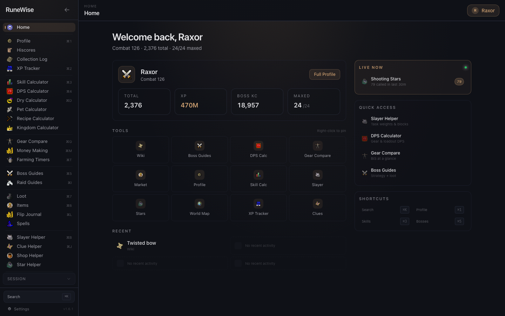

---

## Why RuneWise

Old School runs on knowledge. Wiki tabs, DPS calculators, drop trackers, clue solvers, shop
prices, star radars, farming timers — the modern player juggles a dozen browser tabs just to
play the game. RuneWise pulls all of it into one native desktop app that loads instantly,
remembers your RSN, and updates live.

No accounts. No tracking. No ads. No bloat. Everything your character needs, in one place.

<table>
<tr>
<td align="center" width="33%">

### 🎯 Comprehensive
**30+ tools.** Calculators, guides,
drop tables, market data, live
events, trackers — all in one shell.

</td>
<td align="center" width="33%">

### ⚡ Native & instant
**8 MB Tauri desktop app.**
Launches in a blink, runs offline
where possible, auto-updates.

</td>
<td align="center" width="33%">

### 🔒 Private by default
**No login.** No credentials ever
stored. Only your public RSN is
saved — locally, on this device.

</td>
</tr>
</table>

---

## Download

<table>
<tr>
<th width="34%">Platform</th>
<th width="33%">File</th>
<th width="33%">Notes</th>
</tr>
<tr>
<td>🪟 <b>Windows 10/11</b></td>
<td><code>.exe</code> installer</td>
<td>SmartScreen may warn → <i>More info</i> → <i>Run anyway</i></td>
</tr>
<tr>
<td>🍎 <b>macOS (Apple Silicon)</b></td>
<td><code>aarch64.dmg</code></td>
<td>First launch: System Settings → Privacy → <i>Open Anyway</i></td>
</tr>
<tr>
<td>🍎 <b>macOS (Intel)</b></td>
<td><code>x64.dmg</code></td>
<td>Same as Apple Silicon</td>
</tr>
<tr>
<td>🐧 <b>Linux</b></td>
<td><code>.AppImage</code></td>
<td>`chmod +x` and run</td>
</tr>
</table>

> Updates install in the background. RuneWise checks for new releases automatically.

[**→ Get the latest release**](https://github.com/McNerve/runewise/releases/latest)

---

## What's inside

### Player & Progress

Your hiscores, your way. Profile, XP tracking, collection log, quest tracker, achievement
diaries, and combat achievements — all synced from public OSRS APIs.

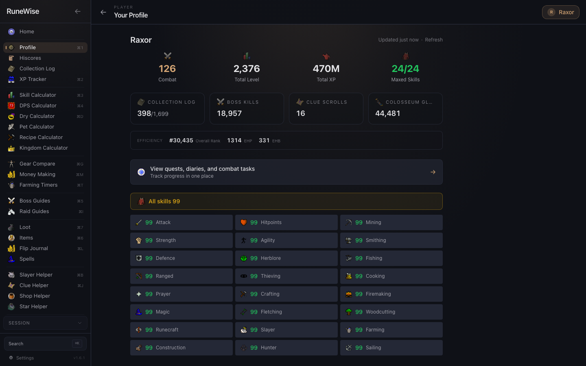

Side-by-side compare with any other player. Track your XP gains, achievements, and records
via Wise Old Man — no login required.

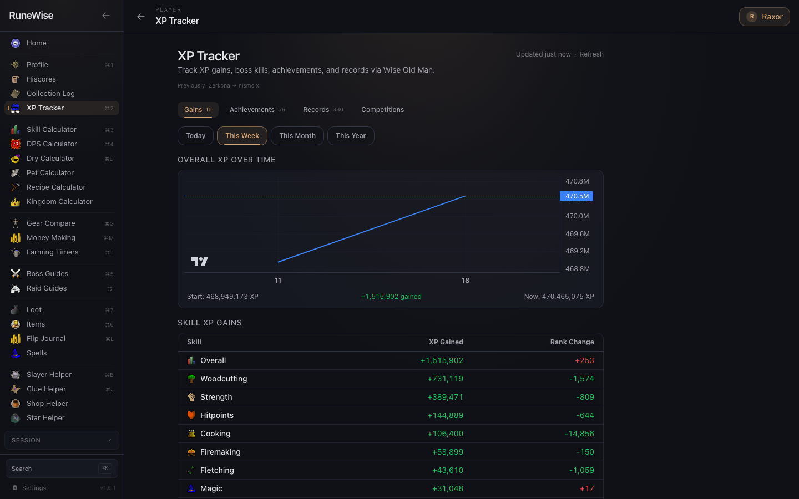

### Calculators

Every number you need to run the game.

<table>
<tr>
<td><b>Skill Calculator</b></td>
<td>24 skills · 140+ methods · intensity badges · GP/XP · hiscores integration</td>
</tr>
<tr>
<td><b>DPS Calculator</b></td>
<td>3,172 monsters · 16 modifiers · phase bosses · spec attacks · spell selection · loadout snapshots</td>
</tr>
<tr>
<td><b>Training Plan</b></td>
<td>Optimal method sequencing with time + cost estimates</td>
</tr>
<tr>
<td><b>Dry Calculator</b></td>
<td>68 boss presets · auto-fill KC from your hiscores · confidence intervals</td>
</tr>
<tr>
<td><b>Pet Calculator</b></td>
<td>68 pets · KC/action-based odds · Temple-synced "already owned" indicator</td>
</tr>
<tr>
<td><b>Recipe Calculator</b></td>
<td>5,300+ recipes · live GE material costs · batch profit math</td>
</tr>
<tr>
<td><b>Kingdom of Miscellania</b></td>
<td>Worker allocation optimiser with live GE prices</td>
</tr>
<tr>
<td><b>Gear Compare</b></td>
<td>BiS by slot, sortable by any stat across 3,000+ equipment entries</td>
</tr>
</table>

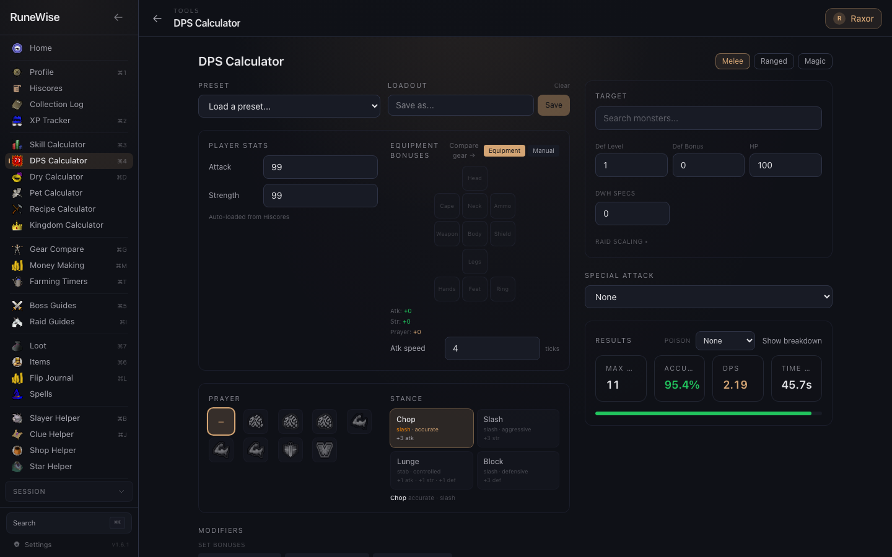

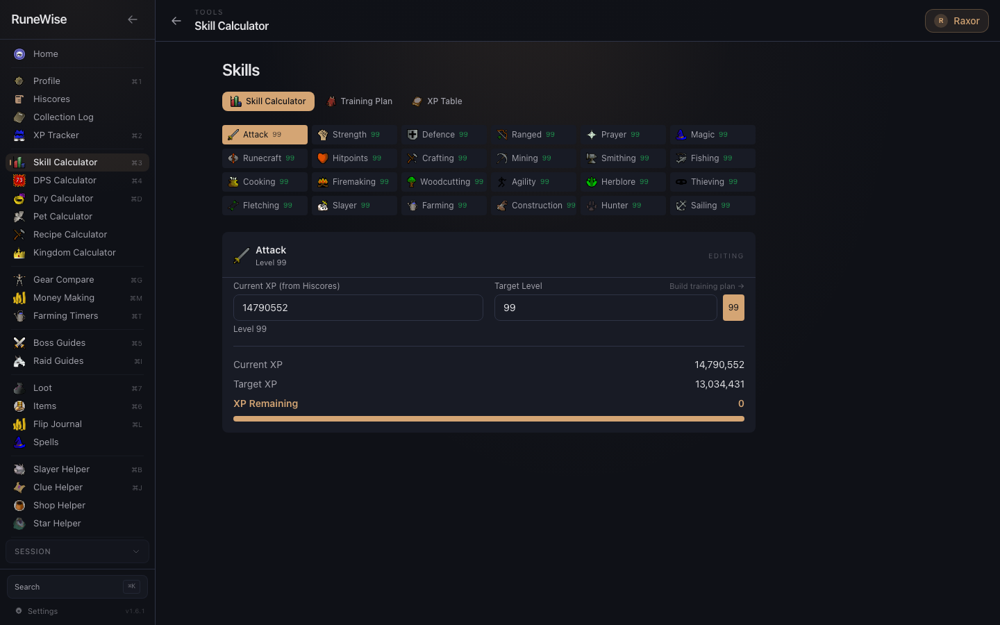

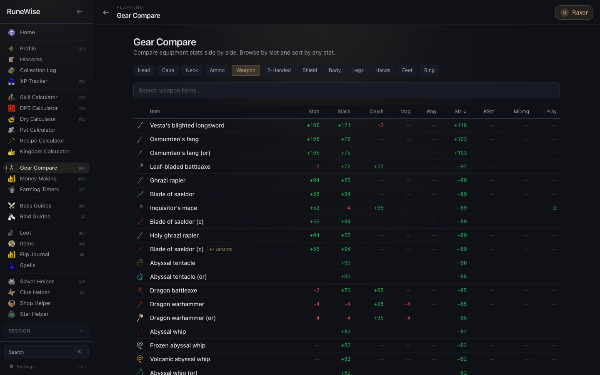

### Bossing

Curated strategy guides pulled live from the OSRS Wiki for 58 bosses, structured into
app-native sections. Your KC, your drop history, your gear — wired together.

- **Infobox-driven chips** — weakness, recommended approach, team size, combat level
- **Full heading hierarchy** — mechanics, phases, and sub-sections preserved (~25+ sections for a raid)
- **Loadout tables** by combat style with ownership checkboxes
- **Drop tables** with live GE prices and GP/hour estimates
- **Raid guides** for CoX, ToB, ToA with split tracking

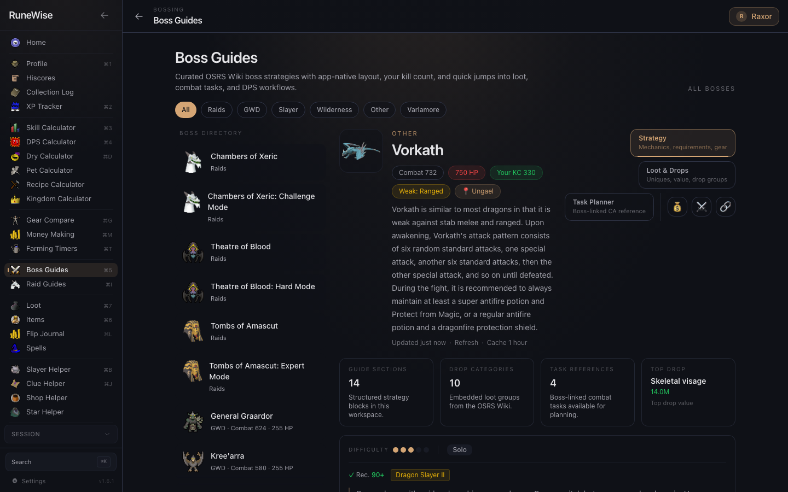

### Market

Every item, every price, updated every couple of minutes.

- Item search with live GE prices, margin, daily volume, buy limit
- Rich tooltips — hover any item name in any table to preview
- Price charts (1D / 1W / 1M / 3M / 6M / 1Y · line or candle)
- Watchlist with threshold price alerts
- High-alchemy profit table with Nature-rune cost built in
- **GE Flip Journal** — log your buys and sells, see cumulative profit over time

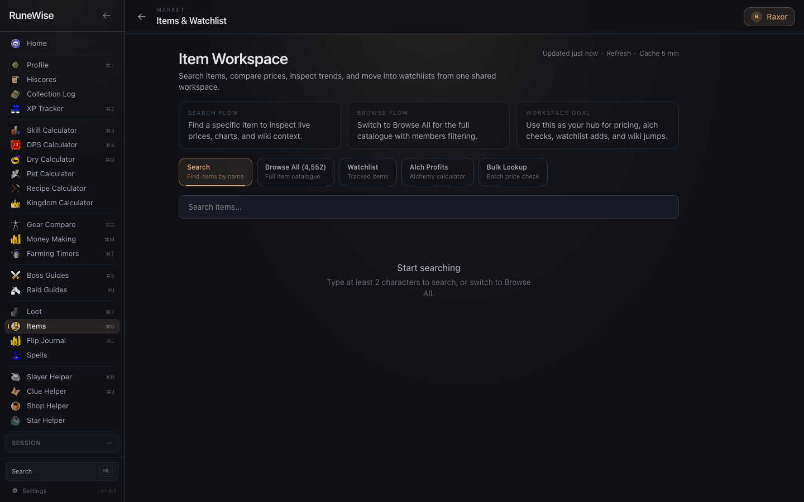

### Guides & Helpers

- **Slayer Helper** — task weights by master, block calculator, reward-shop tracking, strategy guides
- **Shop Helper** — 580+ OSRS shops with live GE comparison and "Save X gp" deltas
- **Clue Helper** — 730 clue solutions, paste-and-solve input, tier + type filters
- **Spellbook** — 224 spells across 4 books with rune costs per cast
- **Combat Achievements** — all 743 tasks organised by tier with completion tracking

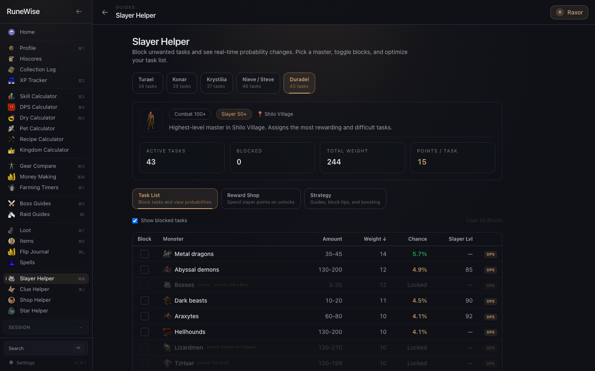

### Live

Real-time game events in one place.

- **Shooting Stars** — live tracker from the Star Miners crowdsource API with tier, world, time remaining, teleport suggestions, and opt-in native spawn alerts
- **World Map** — 114+ hand-placed POIs (farming, fairy rings, slayer, altars, teleports) with cursor-anchored zoom
- **OSRS News** — shipped, upcoming, and proposed updates in one feed
- **Wiki Lookup** — search any wiki page with live GE price enrichment and in-page table of contents

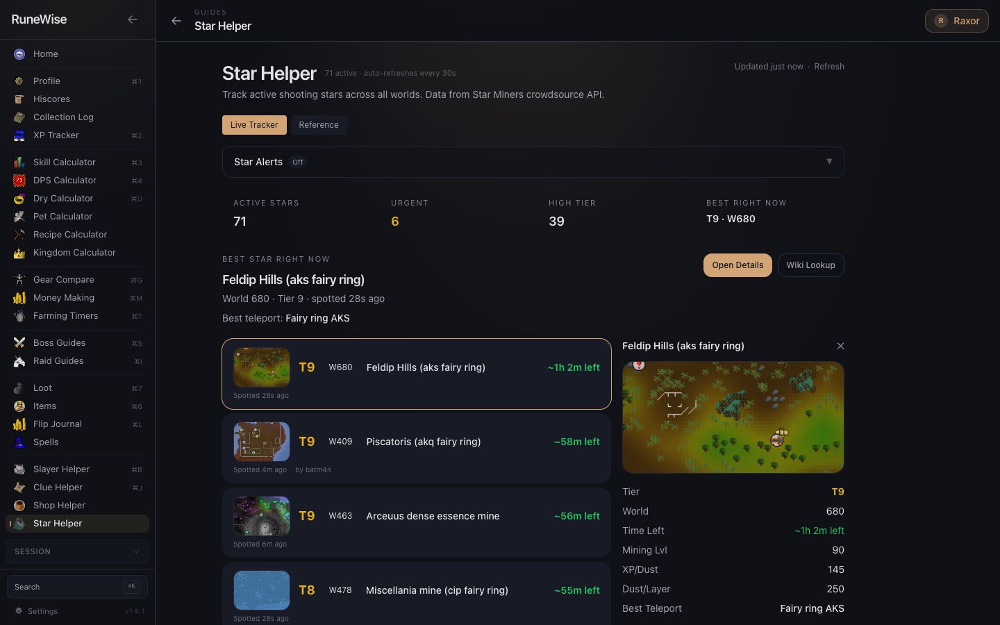

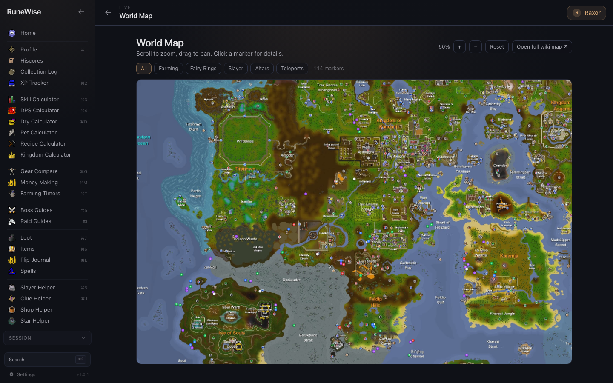

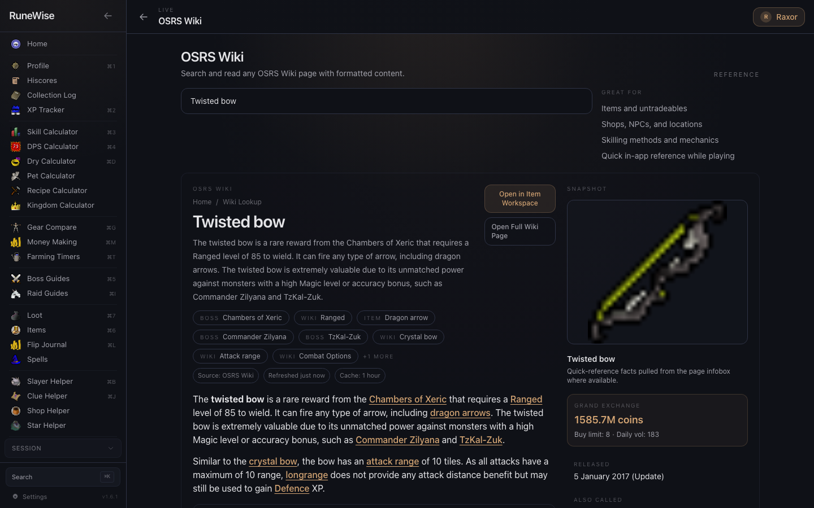

---

## How it works

RuneWise is a read-only client. We pull data from public OSRS APIs and cache locally in
IndexedDB. The game client is never touched; no EULA is ever strained.

| Source | What it provides | License |
|--------|------------------|---------|
| [OSRS Wiki](https://oldschool.runescape.wiki/) | Items, drops, bosses, shops, spells, quests, news, strategies | [CC BY-NC-SA 3.0](https://creativecommons.org/licenses/by-nc-sa/3.0/) |
| [OSRS Hiscores](https://secure.runescape.com/m=hiscore_oldschool/) | Player stats, boss KCs, ironman detection | Jagex |
| [Wise Old Man](https://wiseoldman.net/) | XP tracking, achievements, records, competitions | [MIT](https://github.com/wise-old-man/wise-old-man/blob/master/LICENSE) |
| [Temple OSRS](https://templeosrs.com/) | Collection log data | Public API |
| [Star Miners](https://starminers.site/) | Live shooting star locations | Public API |
| [RuneLite](https://github.com/runelite/runelite) | Clue data | [BSD](https://github.com/runelite/runelite/blob/master/LICENSE) |

---

## Privacy & security

- **Fully open source** — every line is [on GitHub](https://github.com/McNerve/runewise).
- **No account credentials** are ever requested or stored.
- Only your RSN (public username) is saved locally, in browser storage.
- Network calls are restricted to a known allowlist of OSRS API domains.
- The app does **not** interact with the Old School client. No memory reading, no overlay, no automation.

---

## Built with

  
  
  
  
  

Tauri v2 (Rust) · React 19 · TypeScript · Vite 8 · Tailwind CSS 4 · lightweight-charts · Motion

## Contributing

Bug reports, feature requests, and PRs are welcome. See [Issues](https://github.com/McNerve/runewise/issues).

## License

MIT — see [LICENSE](LICENSE).

---

*RuneWise is not affiliated with or endorsed by Jagex Ltd. Old School RuneScape is a trademark of Jagex Ltd.*

